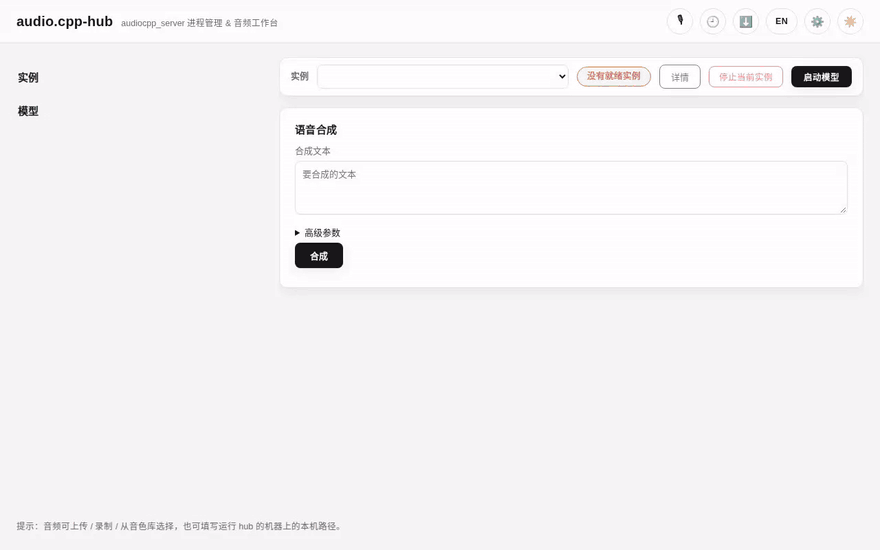
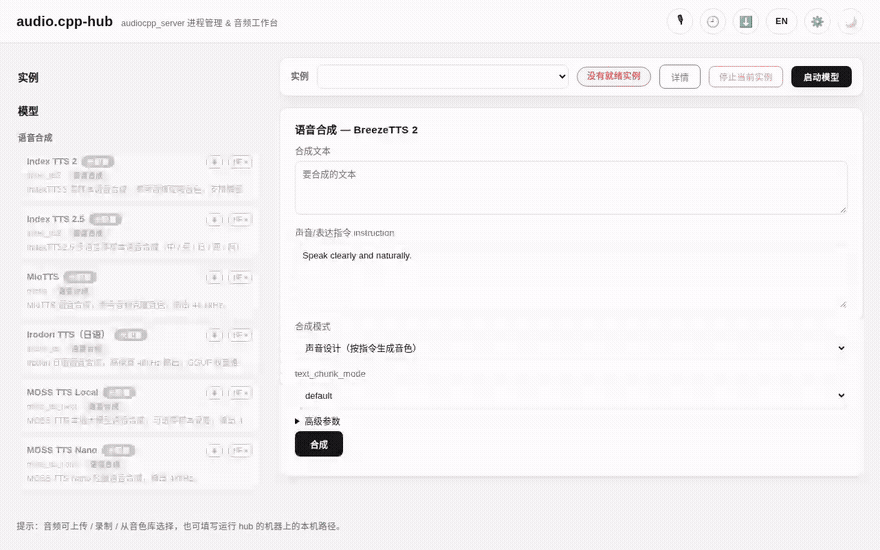

# audio.cpp-hub

**[简体中文](README.md) | English**

A web management panel for [audio.cpp](https://github.com/0xShug0/audio.cpp): a lightweight HTTP service written in Go that starts / stops / monitors multiple `audiocpp_server` model-instance subprocesses, and provides a primarily-Chinese web UI for TTS / ASR / music-separation and other audio tasks.

Repository: <https://github.com/matthewhand/audio.cpp-hub>

- **Native single binary**: the build has no runtime dependencies (static Go build; release packages ship Windows / Linux executables)
- **The hub itself is lightweight**: it does not load model weights — models run in separate `audiocpp_server` subprocesses

## Demo

These GIFs are captured from the running web UI (Playwright recording + ffmpeg encoding), not mockups.

**Overview: model list and a ready instance** — the left rail lists launchable models and instance cards (the BreezeTTS instance is READY here); selecting a model opens its workspace on the right.


**Text-to-speech (TTS)** — type text, synthesise with one click, and play / download the result right on the page (async queue, so you can keep submitting).


**Operation history** — open it from the 🕘 button in the header; expand a record inline and replay the reference / result audio.



**Download manager** — open it from the ⬇️ button in the header to watch weight-download progress and pause / resume / fill the path into the launch form.



## Features

- **Multi-instance management**: writes a `server.json` per instance and launches `audiocpp_server` as a subprocess — automatic port allocation (bound to 127.0.0.1), health polling (up to 120s), log viewing, one-click stop
- **Web UI**: plain HTML/JS frontend (no build step), bilingual Chinese/English, with model selection, parameter forms and task submission
- **Async task queue**: `POST /api/tasks` returns immediately and runs serially per instance; task state is persisted, so tasks survive a page refresh / hub restart, and results can be fetched later
- **TTS operation history**: per-model synthesis records and result audio (no automatic eviction; delete manually), replayable from the history panel, with grouping and inline detail
- **Voice library (reference audio)**: a global resource under `data/voices/` with unique names, rename / reference-text editing / preview
- **OpenAI-compatible proxy**: `GET /v1/models` aggregates all ready instances; `POST|PUT /v1/*` (e.g. `/v1/audio/speech`) routes by the top-level `model` in the body, streaming large base64 through disk the whole way (see OpenAI API Compatibility below for the boundary)
- **Built-in weight downloader**: `POST /api/downloads` performs multi-threaded ranged downloads from HuggingFace (or a modelscope mirror), with resume, pause/resume, and progress/speed stats
- **Device probing**: the start dialog can run `audiocpp_server --list-devices` and render available devices as a dropdown
- **Windows-friendly**: system tray, auto-start, and subprocesses launched without a console window

## Quick Start

### Prerequisites

- Building from source: **Go 1.27+** (`go.mod` declares `go 1.27`; CI uses Go 1.27)
- A runnable `audiocpp_server` binary: release packages **do not include** it. Download the build for your platform / GPU from [audio.cpp Releases](https://github.com/0xShug0/audio.cpp/releases/latest), place it anywhere (e.g. `audiocpp/`), and register it as an executable in the web UI
- Hardware: depends on the `audiocpp_server` build you download. The bundled `executables.json` sample is a **Windows + AMD ROCm** setup (run `--list-devices` to see the actual backends); small models also run on CPU, with speed depending on the model and thread count
- Disk: model weights range from a few hundred MB to tens of GB, so leave ample free space (the hub runs a disk-space pre-check before downloading)

### Using a release package (recommended)

Download the native zip for your platform (`-windows` / `-linux`) from [Releases](https://github.com/matthewhand/audio.cpp-hub/releases) and run it — **no runtime needs to be installed**:

```bash
# Linux
unzip audio.cpp-hub-<version>-linux.zip
cd audio.cpp-hub-<version>-linux
./audio.cpp-hub
```

On Windows, double-click `audio.cpp-hub.exe` (no console window; it goes to the system tray). After startup, visit `http://localhost:8080` (port is `httpPort` in `hub.config.json`; the release package defaults to 8080).

### Building from source

```bash
git clone https://github.com/matthewhand/audio.cpp-hub.git
cd audio.cpp-hub
go build -ldflags "-X main.version=<tag>" -o audio.cpp-hub .
./audio.cpp-hub
```

The working directory must contain `web/` (static pages); `models.json` / `model-packages.json` are embedded via `go:embed` and need no copying. After startup, visit `http://localhost:8080`.

Cross-compiling (when not on Windows):

```bash
CGO_ENABLED=0 GOOS=windows GOARCH=amd64 go build -ldflags "-H windowsgui -s -w -X main.version=<tag>" -o audio.cpp-hub.exe .
CGO_ENABLED=0 GOOS=linux   GOARCH=amd64 go build -ldflags "-s -w -X main.version=<tag>" -o audio.cpp-hub .
```

## Basic Usage

1. **Register an executable**: add the path to `audiocpp_server` in the UI settings (top right); each entry can have its own `env` variables, whose values support `${VAR}` placeholders
2. **Create a launch profile**: pick a model and parameters; model weight paths can be picked via the built-in file browser; use the "advanced parameters" area for one `key=value` per line
3. **Start an instance**: the hub writes `run/<id>/server.json` and launches the subprocess; after the health check passes its status becomes `READY`
4. **Submit tasks**: run inference in the web UI, or call the async task API / the OpenAI-compatible API (`model` = instance service name `instanceName`)

## OpenAI API Compatibility

The hub's `/v1/*` endpoints are a **transparent proxy** to each `audiocpp_server` instance: the hub never modifies request bodies, so the compatibility boundary is set by the upstream `audiocpp_server` and the specific model.

- Supported request shapes (`GET /v1/models` lists the service names of all `READY` instances):
  - `POST /v1/audio/speech` (`model` / `input` / `voice` / `response_format`)
  - Any other `POST|PUT /v1/<path>`, forwarded verbatim (path and body) to the same path on the instance
- **`model` extraction is JSON-only**: the hub streams over the body's top-level `"model"` string. `multipart/form-data` (e.g. a multipart `POST /v1/audio/transcriptions`) cannot be parsed for `model` and returns `400 {"error":{"message":"Missing required parameter: model","type":...}}`.
  - Workaround: use the web UI ASR flow, or call the instance's native task endpoint / `POST /api/tasks` with a JSON body.
- Routing: only `READY` instances are forwarded; an instance still starting returns `409`, an unknown service name returns `404`; a body larger than `proxyMaxBodyBytes` returns `413`.
- There is no overall upstream timeout (TTS can run for a long time); disconnecting the client cancels the forward.
- **Full compatibility with the standard OpenAI interface is not guaranteed, and the root cause is usually on the model side**: audio.cpp aggregates many model families, and the parameters each model requires/accepts differ — the same request that works on model A can fail outright on model B. For example:
  - Voice-cloning models (IndexTTS2, Qwen3-TTS Base, ...) have no built-in voices, so a bare `model` + `input` request fails; you must additionally supply reference audio via `voice_ref`;
  - Qwen3-TTS CustomVoice uses `voice` as a packaged speaker name, while the VoiceDesign variant takes a natural-language voice description in `instructions`;
  - Some standard OpenAI parameters are not supported upstream and are silently ignored, e.g. `speed` and `modalities` on speech;
  - Some models strictly validate unknown options, so sending a parameter they do not recognize can make them reject the entire request.
- The `inputs` / `paramSchema` declarations in `models.json` (which drive the web UI's parameter form) state the required inputs for each model. When a parameter has no effect or a request errors, consult that model's documentation first (the audio.cpp repo's `docs/models/`) — this is usually not a hub forwarding issue.

## Configuration

`hub.config.json` is **optional and is NOT auto-generated by the hub**: if the file exists it is read, otherwise (or on parse failure) the built-in defaults apply.

```json
{
  "httpPort": 8080,
  "instancePortBase": 18090,
  "modelsDir": "models",
  "hfEndpoint": "https://huggingface.co",
  "downloadThreads": 8,
  "downloadSegmentsPerFile": 4,
  "proxyMaxBodyBytes": 1073741824
}
```

| Key | Default | Description |
| --- | --- | --- |
| `httpPort` | `8080` | Port the hub listens on |
| `instancePortBase` | `18090` | Starting port for model instance allocation (bound to 127.0.0.1) |
| `modelsDir` | `"models"` | Root directory weight downloads land in (relative to the working directory) |
| `hfEndpoint` | `"https://huggingface.co"` | Default download source; change to a mirror such as `https://hf-mirror.com` when unreachable |
| `downloadThreads` | `8` | Global download concurrency |
| `downloadSegmentsPerFile` | `4` | Segments per file (minimum segment granularity 32MB) |
| `proxyMaxBodyBytes` | `1073741824` (1 GiB) | On-disk body size limit for `/v1/*` proxy requests |

> The development copy of `hub.config.json` in this repo sets `httpPort` to `18080`, so running from source listens on 18080.

## API Overview

The full endpoint list (method / path / body / response / error codes) is in [`docs/API.md`](docs/API.md) (Chinese-first). Common entry points:

| Endpoint | Description |
| --- | --- |
| `GET /api/models` | Supported model list (embedded `models.json`) |
| `POST /api/instances` | Start a model instance |
| `POST /api/tasks` | Create an async inference task (202, returns immediately) |
| `GET /api/tasks/<id>/result` | Fetch a non-TTS task result |
| `POST /api/run/<instanceId>` | Legacy synchronous forward (TTS results go to history) |
| `/api/history/<modelId>...` | TTS history query / audio retrieval / grouping / deletion |
| `/api/voices...` | Voice library management |
| `/api/downloads...` | Weight download tasks (list / pause / resume / delete) |
| `GET /api/executables/<id>/devices` | Run `--list-devices` to probe devices |
| `/api/fs/*` | Server-local filesystem browsing (for picking weight paths) |
| `GET /v1/models`, `POST|PUT /v1/*` | OpenAI-compatible proxy |

## Directory Layout

```text
main.go / api.go        # Entry point; /api/* routes and handlers
proxy.go                # /v1/* OpenAI-compatible proxy
instance.go             # Instance subprocess lifecycle, health polling, device probing
registry.go             # executables.json / data/profiles.json
task.go                 # Async inference task queue (serial queue, persisted state)
history.go              # TTS history (index.jsonl + result audio + reference snapshots)
voices.go / audio.go    # Voice library; WAV upload and header parsing
download.go / packages.go # Weight downloader; model-packages.json manifest
fs.go / models.go / util.go # Filesystem browser; model list; utilities
web/                    # Frontend static files (no build step)
models.json             # Model list (embedded with go:embed)
model-packages.json     # Download package manifest (embedded with go:embed)
run/                    # Runtime: instance server.json / server.log / proxy cache
data/                   # Runtime: uploads, voices, profiles.json, history, downloads, tasks
models/                 # Runtime: downloaded model weights (modelsDir)
logs/                   # Runtime: logs/hub.log in Windows GUI mode
```

## Security Notice

> **This is a LAN / localhost tool with no authentication and no public-internet hardening.**
>
> Do not expose the port directly to the public internet. For remote access, put a reverse proxy with HTTPS and authentication in front of it yourself.

**All write operations are unauthenticated.** Common mutating endpoints include:

| Method | Path | Effect |
| --- | --- | --- |
| `POST` | `/api/instances`, `DELETE /api/instances/{id}` | Start / stop model subprocesses |
| `POST` / `PUT` / `DELETE` | `/api/executables*`, `/api/profiles*` | Add / edit / delete executables and launch profiles |
| `POST` | `/api/run/{id}`, `/api/tasks` | Trigger inference tasks |
| `DELETE` | `/api/tasks/{id}`, `/api/history/*` | Cancel tasks / delete history records and audio |
| `POST` | `/api/audio/upload`, `/api/voices*` | Upload audio; add / modify / delete the voice library |
| `POST` | `/api/fs/mkdir` | **Create folders at any writable server path** |
| `POST` / `DELETE` | `/api/downloads*` | Download weights (writes to `models/`); delete tasks |

The `/api/fs/*` endpoints intentionally expose server-local filesystem browsing and directory creation — this is by design (the hub is a local single-user tool). See [`SECURITY.md`](SECURITY.md) for the threat model and vulnerability-reporting channel.

## Development & Contributing

Build steps, code style and pre-commit checks are in [`CONTRIBUTING.md`](CONTRIBUTING.md); see [`CHANGELOG.md`](CHANGELOG.md) for the change history.

## Tech Stack & Provenance

- Go 1.27, native single binary; the only dependencies are `github.com/getlantern/systray` (Windows tray) and `golang.org/x/sys`
- Frontend: plain HTML/CSS/JS, with bilingual strings in `web/i18n.js`
- This project is a companion management panel for [audio.cpp](https://github.com/0xShug0/audio.cpp) (fork maintained at <https://github.com/matthewhand/audio.cpp-hub>); it does not bundle upstream binaries — models and inference come from the upstream project
